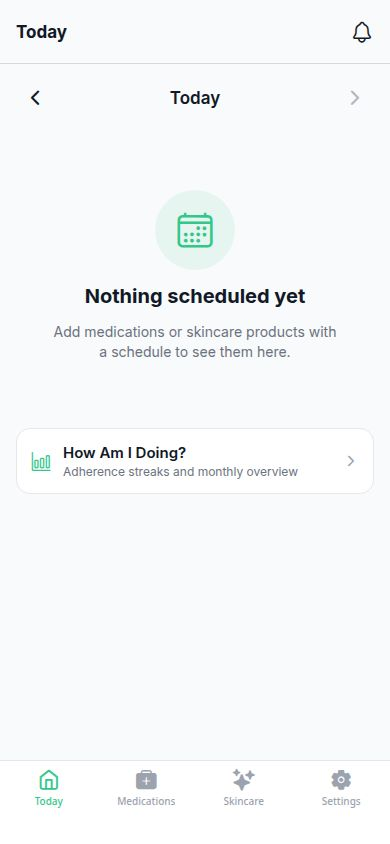
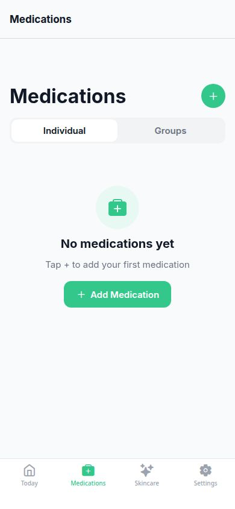
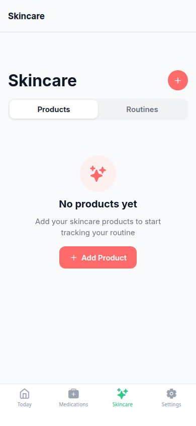
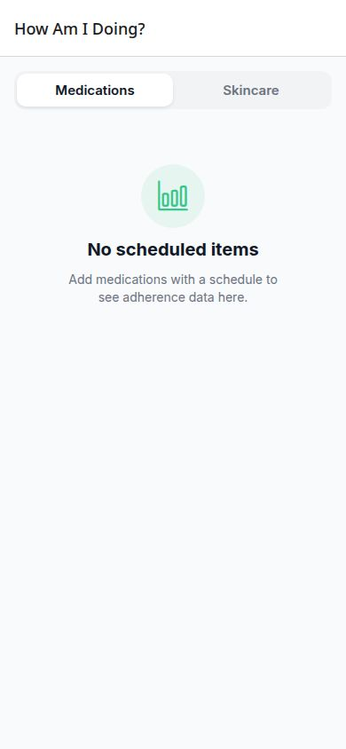
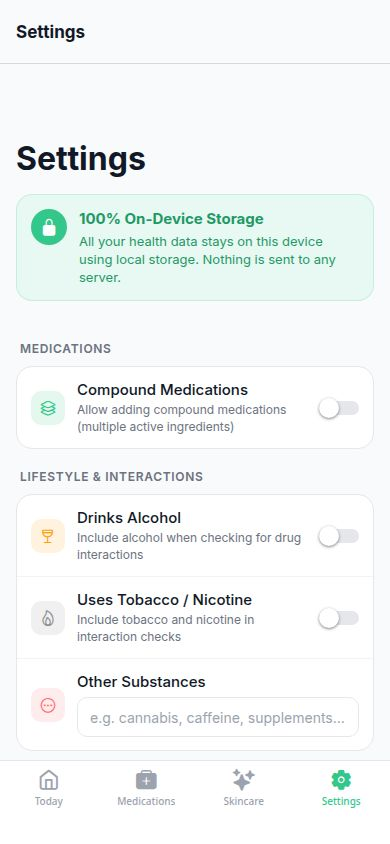

> Built with [Replit](https://replit.com) by dylbr@proton.me

---

# Vital — Personal Health Tracker

**Vital** is an iOS-first personal health tracking app built with Expo React Native. It helps you stay consistent with medications and skincare routines through smart scheduling, adherence tracking, and daily push reminders — all without sending a single byte of your data to a server.

---

## Contents

- [Why Vital](#why-vital)
- [Features](#features)
  - [Today Timeline](#today-timeline)
  - [Medication Tracking](#medication-tracking)
  - [Skincare Tracking](#skincare-tracking)
  - [Drug Interaction Checker](#drug-interaction-checker)
  - [Adherence View](#adherence-view)
  - [Push Notifications](#push-notifications)
  - [PDF Health Report](#pdf-health-report)
  - [100% On-Device Storage](#100-on-device-storage)
- [Getting Started](#getting-started)
- [Tech Stack](#tech-stack)

---

## Why Vital

Most health apps ask for an account, sync your data to the cloud, and monetise it. Vital does none of that. Everything you log — medications, skincare products, dose completions, reactions — lives in encrypted on-device storage. There is no backend, no login, no subscription.

The goal is simple: help you actually take your medications and follow your skincare routine, and give you honest feedback on how well you're doing.

---

## Features

### Today Timeline

The **Today** tab is your daily dashboard. It shows every medication and skincare product scheduled for the current day, grouped by time slot.



- **Date navigation** — tap the left/right arrows to review any past day
- **Group cards** — one card per time slot, showing all items due at that time; one tap marks the entire group complete
- **Individual item detail** — tap a card to open a detail sheet where you can complete or undo items one by one, read medication notes, and see skincare expiry warnings
- **Reactions** — today's logged skincare reactions appear below the completed timeline
- **"How Am I Doing?"** — a persistent shortcut at the bottom of the screen opens the adherence view

**Example:** You have Metformin at 8 AM and a Vitamin D at 8 AM. They appear in a single "8:00 AM" card. One tap completes both and the card moves to the Done section.

---

### Medication Tracking



Add any medication — prescription or over-the-counter — with full scheduling control.

**Schedule options:**

| Schedule | Description |
|----------|-------------|
| As Needed | Item appears in a separate "as needed" section; never triggers adherence penalties |
| Daily | Every day from a start date |
| Every Other Day | Alternating days |
| Weekly | Same day each week |
| Custom | Every N days (e.g. every 5 days) |

**Per-medication fields:**

- Name, dosage amount and unit (mg, mcg, ml, etc.)
- One or more time slots per day (e.g. 8:00 AM and 8:00 PM)
- Free-text notes visible in the detail sheet
- Refill threshold and current stock count for low-stock alerts
- **Compound medication** toggle — add multiple active ingredients for accurate interaction checking

**Medication Groups** — link related medications (e.g. a morning stack) so they always appear together and can be completed as a unit.

**Example input — adding a medication:**
```
Name:       Metformin
Dosage:     500 mg
Schedule:   Daily
Times:      8:00 AM, 6:00 PM
Start date: 2025-01-01
Notes:      Take with food to reduce GI side effects
Stock:      60 tablets   Refill threshold: 14
```

---

### Skincare Tracking



Track every product in your routine with the same scheduling system as medications, plus skincare-specific features.

**Products:**

- Name, brand, product type (moisturiser, serum, SPF, etc.)
- Expiry date (month + year) — Vital warns you when a product is expiring soon or has expired
- Free-text notes for tracking how your skin responds
- Schedule (daily, every other day, etc.) and time slots

**Routine builder** — group products into named routines (Morning, Evening, Weekly treatments) so they appear together on the Today timeline.

**Skincare reaction log** — tap Log Reactions to record how your skin responded today, linked to specific products. Choose a sentiment (positive, neutral, negative) and add a free-text note. Reactions appear in the Today timeline so you always remember the context.

**Product lifecycle management** (long-press any product):

| Action | Description |
|--------|-------------|
| Move to Storage | Pause a product without deleting it — useful for seasonal products |
| Archive (History) | Retire a product while keeping the historical adherence data |
| Restore to Active | Move a stored or archived product back to your active routine |
| Delete | Permanently remove |

**Storage** and **History** sections appear below your active product list and are collapsible.

---

### Drug Interaction Checker

When you open the Medications tab with two or more active medications, Vital automatically queries the **NIH OpenFDA drug interaction API** to check for known interactions.

- Results show as a banner below the medication list — green for no known interactions, amber or red for warnings
- Lifestyle factors included in checks: alcohol, tobacco/nicotine, and custom substances (cannabis, caffeine, supplements) configured in Settings
- If your device is offline, an offline banner appears with a **Retry** button that re-fires the check when tapped

---

### Adherence View

Tap **"How Am I Doing?"** on the Today tab (or swipe into `/adherence`) to open the full adherence dashboard.



**Monthly calendar** — each past day is coloured:

| Colour | Meaning |
|--------|---------|
| Green | All scheduled items completed |
| Amber | Some items completed |
| Red | No items completed (at least one was due) |
| Grey | Future date or no items scheduled |

Swipe left and right to move between months.

**Per-item breakdown** — below the calendar, each medication or skincare product shows:

- Adherence percentage
- Expected / Completed / Missed day counts
- Current streak (consecutive days completed)
- Longest streak ever

**Overall badge** — an encouraging summary label based on your overall adherence rate:

| Rate | Badge |
|------|-------|
| 90%+ | Outstanding! |
| 75%+ | Well done! |
| 50%+ | Keep going! |
| < 50% | Let's build the habit |

Switch between **Medications** and **Skincare** with the tab picker at the top.

---

### Push Notifications

Vital schedules daily reminders for every time slot that has scheduled items. Notifications are updated automatically any time you add, edit, or remove a medication or skincare product (with a short debounce to batch changes together).

- One notification per unique time slot, listing all items due at that time
- Tapping a notification opens the Today tab
- Permission is requested once on first launch

**Example notification:**
```
Vital — 8:00 AM
Time for Metformin 500 mg, Vitamin D 1000 IU, and Niacinamide Serum
```

---

### PDF Health Report

From **Settings → Reports → Export Health Report (PDF)**, Vital generates a shareable PDF snapshot of your health data.



The report includes:

- **Medication adherence summary** — adherence %, expected/completed/missed days, current and longest streak for each medication
- **Skincare adherence summary** — same stats for each skincare product
- **Medication details** — name, dosage, schedule, notes, stock level
- **Skincare product details** — name, brand, type, schedule, expiry date, notes
- Medical disclaimer

The file is shared via the native iOS share sheet so you can send it to your doctor, therapist, or save it to Files.

---

### 100% On-Device Storage

Vital stores everything in encrypted on-device storage using AsyncStorage. There is no user account, no cloud sync, and no analytics SDK.

**What never leaves your device:**
- Medication and skincare data
- Dose completion history
- Reaction notes
- Notification preferences
- Settings

**Backup & Restore** — export a JSON backup file and restore it on any device running Vital.

---

## Getting Started

### Requirements

- [Node.js](https://nodejs.org) 20+
- [pnpm](https://pnpm.io) 9+
- [Expo Go](https://expo.dev/go) app on your iOS or Android device (for development preview)

### Installation

```bash
git clone <repo-url>
cd vital
pnpm install
```

### Run the app

```bash
pnpm --filter @workspace/healthtrack run dev
```

Scan the QR code with Expo Go on your phone, or press `w` to open in your browser.

### Run unit tests

```bash
pnpm --filter @workspace/healthtrack test:unit
```

This runs 21 unit tests covering the schedule computation and adherence calculation logic.

---

## Tech Stack

| Layer | Choice |
|-------|--------|
| Framework | [Expo](https://expo.dev) (SDK 54) + React Native 0.81 |
| Navigation | Expo Router (file-based, tab + modal stack) |
| State | React Context + AsyncStorage |
| Scheduling | `utils/scheduleCompute.ts` (custom, no external lib) |
| Adherence | `utils/adherence.ts` (custom) |
| Notifications | `expo-notifications` |
| PDF export | `expo-print` + `expo-sharing` |
| Drug interactions | NIH OpenFDA RxNorm API (no API key required) |
| Fonts | Inter (400 / 500 / 600 / 700) via `@expo-google-fonts` |
| Icons | `@expo/vector-icons` (Ionicons, Feather, MaterialCommunityIcons) |
| Monorepo | pnpm workspaces |
| Language | TypeScript 5.9 |

---

*Vital is a personal project. It is not a medical device and should not replace professional medical advice. Always consult a qualified healthcare provider before making changes to your medications or treatment plan.*
